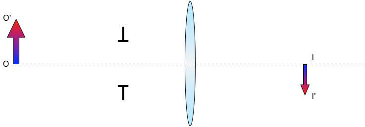

## Examen 2016

*Durée: 25m*

### Question

Un exemple, en vrac, de question pour la partie 1 de l'examen.

1. [Vrai/Faux] Pour toute onde, un seul rayon pointant dans une direction donnée est suffisant pour décrire le front d’onde en tout point 

2. [Vrai/Faux] On ne peut pas décrire une onde plane par une somme d’ondes sphériques, car son front d’onde est droit.
3. [Vrai/Faux] On peut avoir une onde qui a un front d’onde plan mais qui n’est pas une onde plane
4. [Vrai/Faux] Une one plane qui se propage dans l’atmosphère sera perturbée par les variations d’indices de réfraction et ne restera plus une onde plane.
5. [Vrai/Faux] Le vecteur de Poynting correspond à la direction vers laquelle la puissance se propage
6. [Vrai/Faux] Le vecteur de Poynting a les unités de puissance par surface.
7. [Vrai/Faux] La distance focale est définie comme la distance entre la surface (physique) d’une lentille et son point focal.
8. Où sont les plans nodaux et les plans principaux pour une lentille mince ?
9. [Vrai/Faux] Les plans principaux sont des plans conjugués
10. Vous avez un pointeur laser inoffensif et vous voulez viser avec ce faisceau laser un poisson qui se trouve dans un aquarium.  À partir du point A, où devez-vous viser pour atteindre le poisson sous l’eau? Tracez la lumière à partir du point A et expliquez.

 

 

11. [Vrai/Faux] Un miroir sphérique peut avoir des aberrations chromatiques
12. [Vrai/Faux] Pour trouver la position d’une image dans un système optique, on doit tracer au moins 3 rayons provenant de l’objet.
13. **GRIN** Pour quelles longueurs non nulles L une lentille GRIN, décrite par la matrice suivante donnera-t-elle une image à un bout de la lentille pour un objet collé à l’autre bout?

 

14.  Avec l’iris devant la lentille qui bloque la lumière, tracez le rayon marginal du point O et le rayon principal du point O’, sachant que ces points ont des images correspondantes aux points I et I’.

 

15.    [Vrai/Faux] Le diamètre du diaphragme d’entrée (*aperture stop*) est la valeur qui définit le f# du système.

16. [Vrai/Faux] La pupille d’entrée définit la quantité de lumière qui entre dans un système

16. [Vrai/Faux] L’élément A d’une matrice représente toujours le grossissement.

16. [Vrai/Faux] La matrice suivante représente un ou plusieurs éléments optiques.

    

    1. La focale équivalente est de  0.50 cm
    2. Il n’y a pas de focale équivalente, car l’élement B n’est pas zéro comme dans une lentille mince
    3. Si je mets un objet devant ce groupe d’élements optiques, une image virtuelle ou réelle existera

17.  [Vrai/Faux] Une goutte d’eau sphérique agit comme une lentille épaisse.

18.  [Vrai/Faux] Les lunettes corrigent la vue en diminuant ou augmentant la distance focale du système complet de l’œil et des lunettes ensemble

19.  [Vrai/Faux] L’étoile Vega, qui sous-tend un angle de 1 milliradians, formera un point sur une camera puisqu’elle est infiniment loin.

### Réponse

