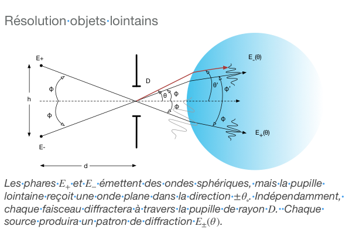

## Résolution de l'oeil

Durée: 120m

### Question

Les deux phares d’une voitures sont séparés par une distance de $h = 1.5 \text{ m}$.  Quelle est la distance maximale  $d$ à partir de laquelle vous pourrez résoudre les deux phares comme étant distincts si votre pupille a un diamètre de  $D = 5 \text{ mm}$ et que la longueur d’onde principale est de 550 nm ?

### Réponse

#### Stratégie

 L’onde de chaque phare frappe l’ouverture circulaire de l’oeil et diffracte en un disque d’Airy (le champ en fonction de l’angle). Ceci correspond à un ensemble de rayons qui frappent la lentille de l’oeil. On solutionne d’abord en ignorant l’oeil.  Ensuite, on montre que finalement, la réfraction à l’interface de l’oeil ne change rien à la résolution.

Les phares $E_+$ et $E_-$ émettent des ondes sphériques, et chacune diffracte dans l’ouverture de la pupille.  On obtient les champs diffractés selon $\theta$ tout de suite après la pupille centré sur $\pm\phi$:

$$
E_\pm\left( \theta \right) \propto  E_\circ\frac{2 J_1 \left( \frac{ \pi D \sin( \theta \pm \phi)}{\lambda } \right)}{ \left( \frac{\pi D\sin( \theta \pm \phi)}{\lambda } \right)}
$$

On utilise le critère de Rayleigh, c’est-à-dire le premier minimum (zéro) du patron de diffraction [~] doit être superposé au maximum du patron de diffraction de l’autre faisceau [~] à [~]. On veut donc:

$$
E_+(\theta = \phi) = \text{Premier zéro de la fonction }J_1
$$

Lorsque l’argument de $J_1(x)$ est $,\frac{ \pi D \sin( 2\phi)}{\lambda }  = 3.82$ nous obtenons $\phi  = 1.22  \frac{\lambda}{2D}$. Par considération géométrique, on obtient simplement que $\tan \phi \approx \phi = \frac{h}{2d}$ donc 

#### Est-ce que l’indice de l’oeil ou sa courbure sont importants?

Le rayon au centre de la pupille est réfracté lors de la traverse de l’interface diélectrique. La relation entre l’angle avant l’interface $\theta$ et après l’interface $ \theta'$ est par la loi de Snell:
$$
\theta^\prime=\frac{\theta}{n}
$$

ce qui est équivalent à la transformation par une interface courbe avec les matrices ABCD pour un rayon au centre de la pupille. On remplace pour obtenir une expression en fonction des angles $\theta^\prime$ et $ \phi^\prime$ à l’intérieur de l’oeil :
$$
E^\prime_\pm\left( \theta^\prime \right) \propto  E_\circ\frac{2 J_1 \left( \frac{ \pi D \sin( n\theta^\prime \pm n\phi^\prime)}{\lambda } \right)}{ \left( \frac{\pi D\sin( n\theta^\prime \pm n\phi^\prime)}{\lambda } \right)}
$$

On refait le même cheminement: en fonction des angles intérieurs le premier minimum (zéro) du patron de diffraction $E^\prime_+(\theta^\prime) $  doit être superposé au maximum du patron de diffraction de l’autre faisceau à $\phi^\prime$.

$$
E^\prime_+(\theta^\prime = \phi^\prime) = \text{Premier zéro de la fonction }J_1
$$

On obtient donc: $\phi^\prime  = 1.22  \frac{\lambda}{2nD}$. Donc l’angle minimal pouvant être résolu est en effet plus petit *à l’intérieur de l’oeil*, cependant, un rapide calcul montre bien que l’angle correspondant à l’extérieur, entre les deux phares, est toujours le même car on a:
$$
\phi = n\phi^\prime =  1.22  \frac{\lambda}{2D}
$$

Donc l’oeil et son indice de réfraction n’ont pas d’impact sur la résolution.

