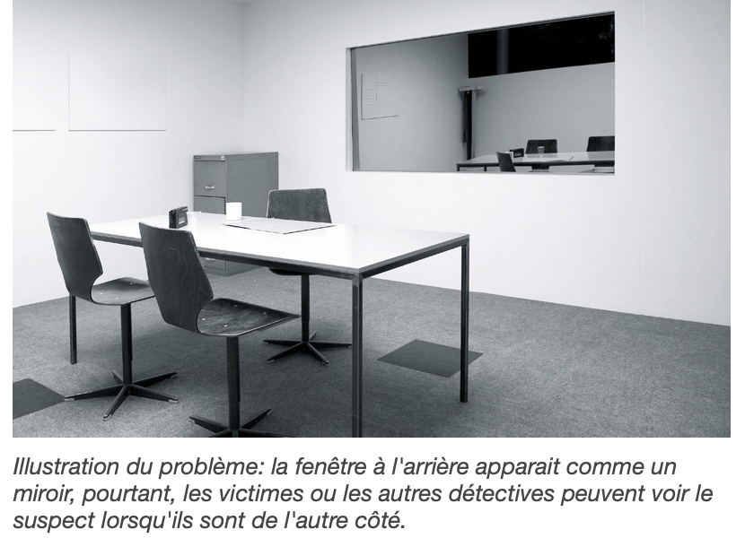

[TOC]

# 001-Ondes

## Rayon et front d'onde

*Durée: 1m*

### Question

**[Vrai ou Faux]** Pour toute onde, un seul rayon pointant dans une direction donnée est suffisant pour décrire le front d’onde en tout point.

### Réponse

Faux. Pour une onde plane (i.e. un front d'onde plan), tous les rayons sont perpendiculaires au front d'onde et parallèles entre eux.  Au contraire, une onde sphérique (i.e. un front d'onde courbe) a plusieurs rayons différents qui ne sont pas parallèles entre eux, donc plusieurs rayons représentent 

## Origine de l'indice de réfraction

*Durée: 1m*

### Question

Quel(s) terme(s) des équations de Maxwell est ou sont impliqué(s) dans la définition de l’indice de réfraction?

### Réponse

La constante diélectrique $\epsilon = \epsilon_r \epsilon_\circ$ est relié à l'indice de réfraction par $n \equiv \sqrt{\epsilon_r}$.

## Solution équation de Maxwell indépendante du temps

*Durée: 10m*

### Question

Trouvez une solution de l’équation d’onde vectorielle tridimensionnelle dépendente du temps:
$$
\mathbf{\nabla}^2 \mathbf{E} + \mu_\circ\epsilon \frac{\partial^2 \mathbf{E}}{\partial t^2} = 0
$$
par séparation de variables.

### Réponse

## Vecteur de Poynting 

*Durée: 1m*

### Question

**[Vrai ou Faux]** Le vecteur de Poynting correspond à la direction dans laquelle la puissance se propage.

### Réponse

Vrai. Il s'agit de la définition exacte du vecteur de Poynting, qui est donné par $\vec{S} \equiv \vec{E}\times\vec{H}$.

## 

## Solution à l'équation d'onde

*Durée: 10m*

### Question

Montrez qu’une onde plane $\mathbf{E}\left( \mathbf{r}, t\right) = \mathbf{E}_\circ e^{i \left(\mathbf{k} \cdot \mathbf{r} - \omega t\right) }$ est une solution de l’équation d’onde.

### Réponse

## Somme d'onde sphériques

*Durée: 1m*

### Question

**[Vrai ou Faux]** On ne peut pas décrire une onde plane par une somme d’ondes sphériques, car son front d’onde est droit.

### Réponse

Faux.  L'ensemble des ondes planes est une base complète qui peut représenter tout onde, c'est-à-dire:
$$
\vec{E}(r,t) = \sum_{\vec{k}} \vec{E}(\vec{k})e^{i (\vec{k}\cdot\vec{r} - \omega t)}
$$
C'est la même chose pour les ondes sphériques:
$$
\vec{E}(r,t) = \sum_{\vec{r}_i} \vec{E}(\vec{r}_i)e^{i (k \left| \vec{r}-\vec{r}_i \right| - \omega t)}
$$

## Question

Sur la figure suivante:

tracez les rayons cardinaux passant par les points focaux [~] et [~] , nodal [~] et [~] et par les plans principaux [~] et [~] .

## Réponse

## Question

**[V ou F]** La distance focale est définie comme la distance entre la surface (physique) d’une lentille et son point focal.

## Réponse

## Question

**[V ou F]** Les plans nodaux sont des plans de grossissement angulaire unitaire.

## Réponse

## Question

**[V ou F]** Les plans principaux sont des plans de grossissement transverse unitaire.

## Réponse

## Question

Où sont les plans nodaux et les plans principaux pour une lentille mince ?

## Réponse
## Question

Imaginez une série arbitraire de plaques diélectriques parallèles, d'indices de réfraction tout aussi arbitraires mais sans absorption, le tout, dans l'air (comme une fenêtre multi-couche épaisse).  Démontrez de façon générale la relation entre les coefficients de réflexion (ou de transmission) dans un sens et l'autre, c'est-à-dire qu'arrive-t-il à l'intensité de la lumière provenant de la gauche et celle provenant de la droite en termes de coefficients de Fresnel ? Vous devez obtenir que le coefficient de transmission (ou de réflexion) de l'intensité par la gauche et par la droite est identique s’il n’y a pas d’absorption.

## Réponse## Question

Vous savez que les coefficients de transmission par la gauche ou par la droite sont identiques (même chose pour les coefficients de réflexion). Dans les émissions de télé de Gangsters et Police, il y a souvent des fenêtres “miroirs” où le suspect ne peut pas voir à l’intérieur, mais les victimes peuvent le voir et essayer de l’identifier.  À la lumière de la question précédente, expliquez ce qui se passe de façon formelle.  Vous devriez utiliser une petite égalité très simple pour supporter votre explication.

## Réponse## Question

Pour une lentille biconvexe diélectrique épaisse d’indice n et de rayons de courbure avant et arrière identiques R, obtenez une expression pour l’épaisseur qui donne une distance focale infinie.

## Réponse## Question

Lorsqu’on regarde dans l’eau sans lunettes de plongée, on ne voit pas très bien.  Au contraire, avec des lunettes de plongée, on voit clairement les objets.  Comment expliquer cela considérant que l’oeil est identique dans les deux cas et que les lunettes de plongée sont plates?

## Réponse## Question

Vous avez un pointeur laser inoffensif rouge et vous voulez viser un poisson rouge qui se trouve devant vous dans un lac sans vague alors que vous êtes sur un quai.  Vous regardez le poisson.  Où devez-vous viser pour atteindre le poisson sous l’eau: un peu en avant, un peu en arrière ou exactement où vous le voyez?

## Réponse

## Question

Un miroir inverse la gauche et la droite. Pourquoi n’inverse-t-il pas le haut et le bas?

## Question

Quelle est la position de l’image si un objet est placé à $f/2$ devant une lentille de distance focale  $f$ ? L’image est-elle virtuelle ou réelle ? 

## Réponse## Question

**[VRAI ou FAUX]** Pour trouver la position d’une image dans un système optique, on doit tracer au moins 3 rayons provenant de l’objet.

## Réponse

Faux.  Deux sont suffisants.